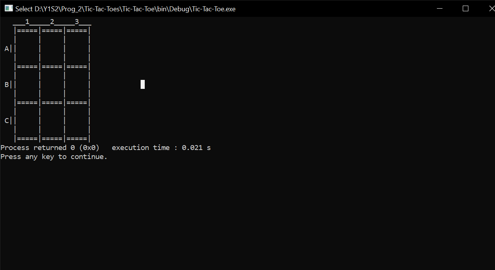
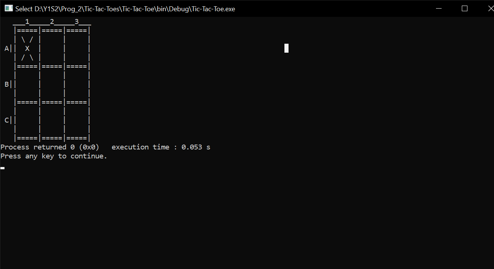
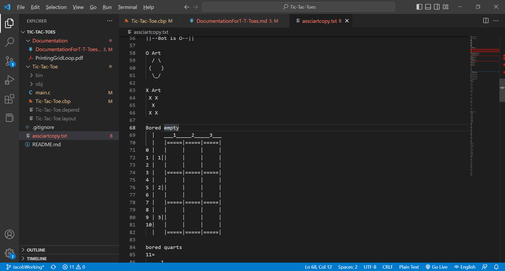

# Toe Documentation.
This file will contain all documentation pertaining to my code for the tic tac toe project in C

I will do my best to keep a log of the times I work on this project. Look at the commit list to see how the work has developed.
## Feb 7
### 4:00 - 5:00
running into some issues with too many arrays. Going to work on it some more when I get home
## Feb 8
### 8:25 - 8:35 am
Started the Flowchart for the grid printer.
### probably 20 minutes of work during linux
I ran into a probably with the flowchart. Turns out I wasn't signed into lucid through my school account. Long story short, I couldn't make it the right size. I've fixed the issue though so there shouldn't be any issues with flowchart size. Still a work in process so ignore the version of the pdf found in this commit.
### Worked on the flow for about 45 mins
I think I have the charts logic mostly filled out. It might not be the most optimal, but I have enough information to write and implement the code. I'll start coding after class, and clean up the flowchart for later reference.
### 4:00 - 5:00pm
I was able to implement the flowchart, all be it there were come flaws with the ASCII art so I will fix that when I get home. I'll explain that in further detail then.
### 6:00 - 7:00pm
So, what was my issue? To put it simply, whitespace. The issues of primary came form how the "\n" was placed in the variable eline. Because eline had a return character and the loop put another return character after each loop of "i", the an extra line was placed of line 3 and 7 (see an ASCII mock-up below in Fig 3. These changes have also been documented in asciiArtFromLiamforReference.txt). 

 
fig 1. ASCII Tic-Tac-Toe table in the terminal

 
fig 2. ASCII Tic-Tac-Toe table in the terminal with ASCII X

 
fig 3. Previous ASCII art X with Current O as well as ASCII table with index that my for loop runs through

My time during this session was fixing the code and cleaning up my documentation to look better.
## Feb 9
### 3:00 - 4:00pm
I started working on the user input portion of the program and and into a major snag. There was a bug in how the program read input and it frustrated me to the point where I have to take a break for the day. I'll work on it tomorrow
## Feb 10
### 8:45 - 10:00am
The bug has been fixed! They were more problems in fixing it however. The first issue I ran into was a frustrating one. To make a long story short, the compiler wouldn't comply the program properly for whatever reason. It was solved by simply rebuilding the program, but my stubborn ass didn't think of that until Nathan Suggested it (Thanks Nathan ;). The second major issue was with how scanf worked. To put it simply, ive been using scanf wrong this entire time. Turns out, you scan and input into the pointer instead of into the variable. Needless to say that I appreciate the  learning experience. I think my next step is to create a way to insert a value into the grid. This should be interesting since I don't know how I'll be able to move the gird around properly.
## Feb 15-16
### About 3 - 4 hours of work
I forgot to document my work from yesterdays so I'll lump in yesterdays info with today's. The 15th is where a majority of the work took place. I started working on the ability to take the users input and see if I could input it into the actual 2d array for the grid. On there are several solutions I could use to do this, the first would be to make "grid" a global variable, but that's to easy. I could have simply changed the data in main, but again, to easy. That is why I decided to use pointer. This was a mistake and probably a small waste of time. Only a small one though. So why pointer? Simple, arrays in C can't be return in a function, but there pointers can. So its a simple as referencing a pointer, throw it into a function, and then dereferencing right? Well yes, but I didn't have much luck finding any info online so I needed Nathan's help. We did eventually figure it out. As far as I can tell, the syntax for get an array out of a pointer is:

`x = *(ptr + i);`

This will essentially reference a point in that array where i is the index with this, I could essentially pop a single value in an array that I want, which could be assigned to a variable of my choice(x). For dereferencing 2d arrays, the syntax becomes

`z = *(ptr[x] + y);`

This will assign the variable z, the value of the array reference by ptr at the coords [x] [y]. These are very useful to know I and I definitely should remember them. Besides the ability to rewrite values in arrays, I have also add a function to check all possible win conditions, and allowed main to return a value to the menu that will allow the program to keep score. I've finished the actual code for the program for now, all I have to do is ready the file to become a library that will be reference in Liam's code.
### 12:45 - 1:00pm
After some research I was able to create a header file that can be referenced by the main function that liam has written (Look here for reference in header files: https://www.geeksforgeeks.org/write-header-file-c/). All that needs to be done now is push and merge this branch with main, and adding the header file to the main work folder.